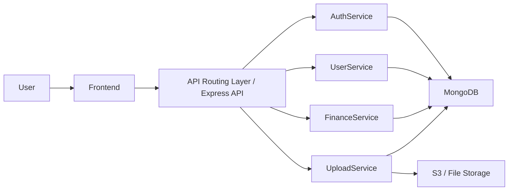
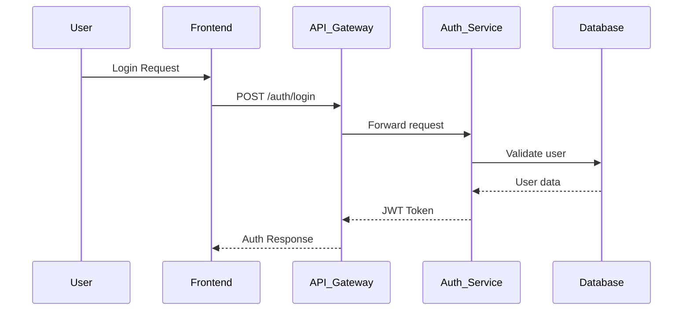
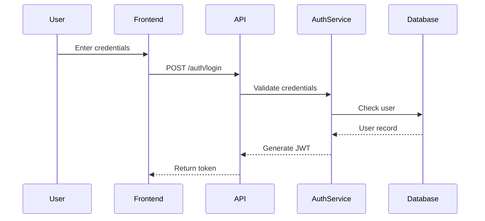
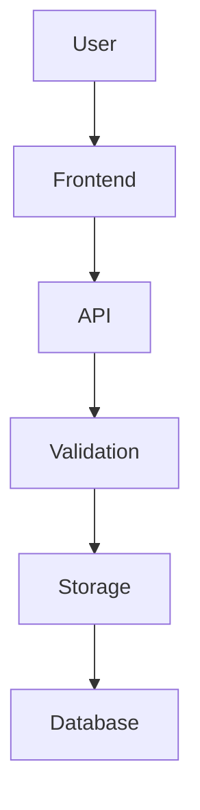

## 📄 Re;Read Website

Re;Read is an online platform for buying and selling second-hand books.  
It gives students and readers access to quality and affordable books.  
The site is built with HTML, CSS, JavaScript, Bootstrap, Node.js, and MongoDB.

---

## 📄 Overview

Re;Read provides a simple way to browse, select, and purchase used books.  
It focuses on ease of use, mobile responsiveness, and a clean shopping flow.  
The project follows a static front-end structure that can be integrated with backend services. The project is a full-stack application integrated with a Node.js backend and MongoDB database.

**Key Highlights:**

- Mobile-responsive UI
- PH region-based checkout logic
- Organized page structure
- Bootstrap UI components

---

## 📚 Features

- Homepage with featured books
- Shop page with listing of books
- Add to cart functionality
- Dynamic cart badge display
- Checkout with PH regions and provinces
- Responsive header and footer
- Unified navigation across pages
- **RESTful API** integration
- **CRUD operations** for cart and orders

---

## 📁 Project Structure

```text
ReRead-Website/
│
├─ index.html                 → Homepage
├─ pages/
│  ├─ shop.html               → Shop listing
│  ├─ cart.html               → Cart page
│  ├─ signin.html             → Sign in
│  ├─ about.html              → About page
│  ├─ profile.html            → User profile
│  ├─ orders.html             → Order history
│  ├─ sell.html               → Sell books page
│
├─ styles/
│  └─ main.css                → Global styling
│
├─ scripts/
│  ├─ main.js                 → Header and navigation logic
│  ├─ shop.js                 → Shop logic
│  ├─ auth.js                 → Authentication logic
│  ├─ profile.js              → Profile management
│  ├─ orders.js               → Order history logic
│  ├─ checkout.js             → Checkout and PH regions handling
│
├─ images/                    → Assets and icons (FRONTEND ASSETS FROM LAST TERM)
├─ ph-locations.json          → PH regions dataset
└─ README.md                  → Project documentation
```

---

## 🧰 Tech Stack
- Node.js
- Express.js
- MongoDB (Mongoose)
- JWT Authentication (access + refresh flow)
- AWS S3 file storage integration
- API routing layer (service endpoints grouped under `/api/*`)
- Security middleware (Helmet, rate limiting, validation)

---

## 🖥️ Installation Guide


[Documentation](https://docs.google.com/document/d/e/2PACX-1vTvfrCYI20_51vzLveFvCZ2oU3REWhclaSW9Hstf9uHFjYp5le1V4jBEMPjGQoor6Q5WomuTDnkj8Qg/pub)


---

## System Architecture

The current integration follows a standard client-server pattern where the frontend sends API requests to backend route groups (acting as the API routing layer), and those services interact with MongoDB and S3/file storage.



**Request Flow (Authentication Example)**


---
## Authentication System

The backend authentication flow includes registration, login, token issuing, and token verification middleware for protected routes.

**Core Flow**

- **User Registration**: Creates a new user after validating required fields, email format, and password strength.
- **User Login**: Verifies credentials and returns JWT-based session credentials.
- **JWT Token Generation**: Access and refresh tokens are generated on successful authentication.
- **Token Validation Middleware**: `authenticateToken` middleware verifies token authenticity before allowing protected-route access.

**Authentication Endpoints**

| Endpoint | Method | Description |
| --- | --- | --- |
| /auth/register | POST | Register new user |
| /auth/login | POST | Authenticate user |
| /auth/request-password-reset | POST | Request password reset |

**Security Notes**

- Access tokens should be sent in authorized requests to protected endpoints.
- Authentication middleware blocks unauthenticated requests.
- Secure route protection ensures profile/account operations are available only to valid authenticated users.


---

## File Upload System

The backend upload pipeline accepts multipart requests, validates files, and stores uploaded assets in external storage.

**Upload Controls**

- **File validation** before upload begins.
- **Allowed file types**: `jpg`, `png`, `pdf`.
- **Maximum file size**: `5MB`.



**How URL persistence works**

After successful upload, the storage service returns a file key/URL. That file URL is stored in the corresponding MongoDB document (for example, profile image or listing asset reference), allowing the frontend to fetch/render the file later.

---

## Authorization / Role System

Re;Read uses role-based access control (RBAC) to define what each authenticated user can access.

**Role Examples**

- `user`
- `admin`

**Middleware Functions**

- `authenticateToken`: verifies JWT and attaches user identity to the request.
- `requireRole`: ensures the authenticated user has the required role(s) before endpoint execution.

**Access Rules**

| Action | Role |
| --- | --- |
| Access dashboard | user |
| Manage users | admin |
| View financial data | admin |

---

## Database Schema

The backend is modeled with MongoDB collections for user identity/account data and transactional application records.

**User Schema (example fields)**

- `name`
- `email`
- `password`
- `role`
- `profilePicture`

**Transaction Schema (example fields)**

- `amount`
- `type`
- `userId`
- `timestamp`

**Relationships**

- A user can own many transaction records (`User` 1-to-many `Transaction`).
- File references (such as profile pictures or uploaded assets) are stored as URL/key fields in user or domain documents.

---

## Security Measures

Milestone 2 backend hardening includes multiple security layers:

- **Helmet.js** for secure HTTP headers
- **Input validation** in request validators
- **JWT authentication** for user identity and session security
- **Role-based access control** for privileged endpoints
- **Secure password hashing** with `bcrypt`
- **Rate limiting** on sensitive routes (e.g., auth endpoints)

**Protected route behavior**

Protected routes run authentication middleware first. If the token is missing/invalid, the request is rejected. If role checks fail, access is denied before controller logic executes.

---

## Error Handling

The backend uses consistent status codes and centralized middleware to standardize error responses.

**Common API Errors**

- `401 Unauthorized`
- `403 Forbidden`
- `404 Not Found`
- `500 Internal Server Error`

**Centralized middleware**

A global error handler captures thrown/forwarded errors, logs context, and returns sanitized responses so clients receive predictable error payloads.

---


---

## 📄 VS Code Extensions Used

- **Live Server** (ritwickdey.LiveServer)
- **Prettier** - Code formatter (esbenp.prettier-vscode)
- **Auto Rename Tag** (formulahendry.auto-rename-tag)
- **IntelliSense for CSS class names in HTML** (Zignd.html-css-class-completion)
- **HTML CSS Support** (ecmel.vscode-html-css)
- **Better Comment** - Comment formatter for clean comments

---

## 📄 Acknowledgments

I would like to thank the following people and resources for their valuable guidance and support in my web development journey:

- **SDPT Solutions (YouTube)**
- **W3Schools**
- **StackOverflow** - some devs insights/quick tutorials
- **Felix Macaspac (TikTok Dev Content Creator, FrontEnd Dev)** — tips and best practices using HTML/CSS/JS.
- **Bryl Lim (TikTok Dev Content Creator, FullStack Dev)** — tips and best practices.
- **Rics (TikTok Dev Content Creator, Cloud Engineer)** — tips and best practices.
- **PaulSong213 (GitHub)** — ph-locations dataset
- **Lebron Piraman** — assistance with [book].png URL links finding in G00gle scripts/shop.js. [NOW IN API, Dec 2025]

Their insights and educational content helped me gain a deeper understanding of web development concepts and best practices.

---

## 👥 Contributor

- **Developer:** Shakira Angela Casusi
- **Focus:** FrontEnd & BackEnd Development
- **Date Started:** September 2025
- **Date Ended:** --- 2026
- **Project Status:** ---


---

- **Support/Co-Developer:** Paul Kenneth Agripa
- **Focus:** ---
- **Date Started:** December 2025
- **Date Ended:** --- 2026
- **Project Status:** ---

