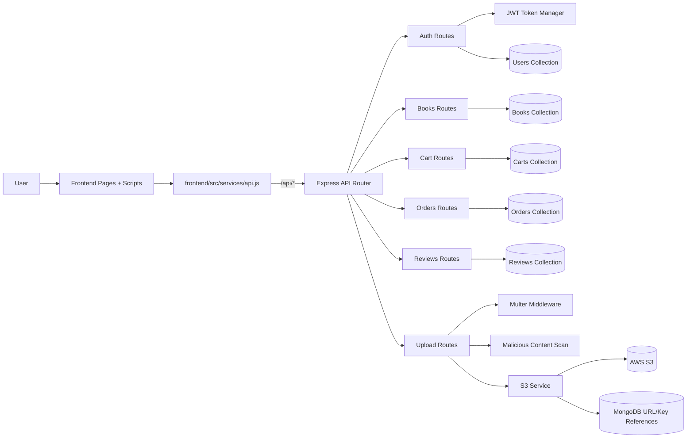
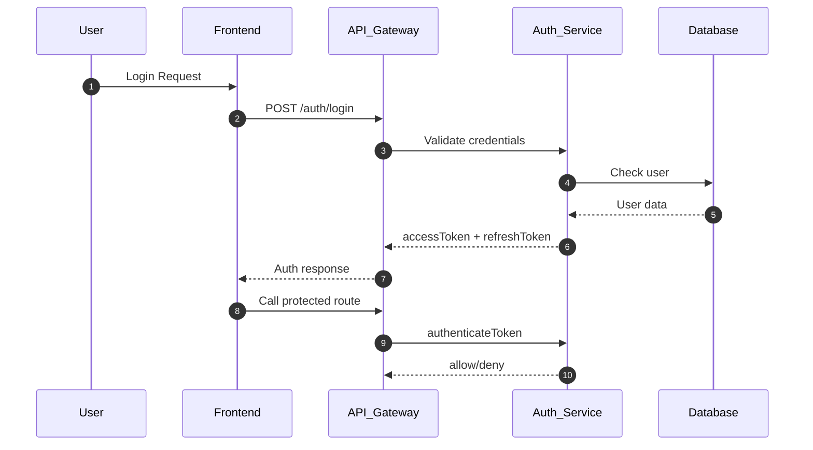
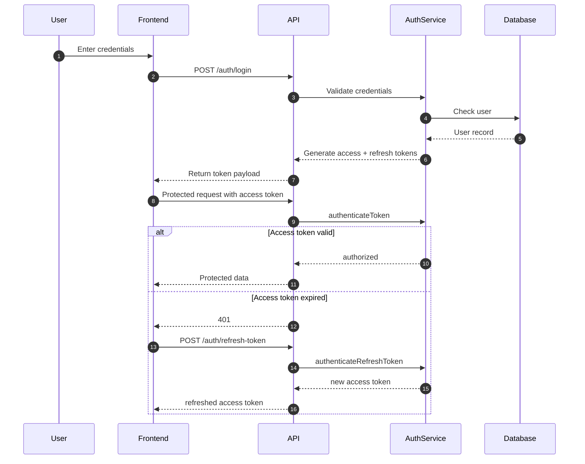
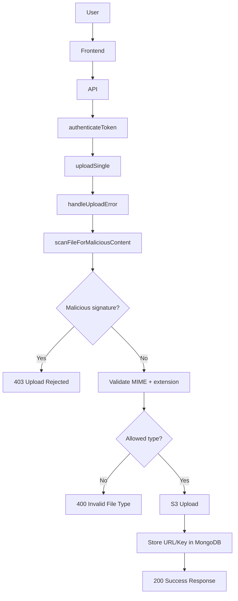

## 📄 Re;Read Website

Re;Read is an online platform for buying and selling second-hand books.
It gives students and readers access to quality and affordable books.
The site is built with HTML, CSS, JavaScript, Bootstrap, Node.js, and MongoDB.

---

## 📄 Overview

Re;Read provides a simple way to browse, select, and purchase used books.
It focuses on ease of use, mobile responsiveness, and a clean shopping flow.
The project started with a static front-end structure and is now integrated with a Node.js backend and MongoDB database.

---

## 📌 Recent Changes (March 2026)

- Frontend API base URL updated to deployed backend: `https://reread-kz72.onrender.com/api`.
- Jest added/verified in backend devDependencies and scripts (`test`, `test:watch`, `test:coverage`).
- Token and validator unit tests with coverage artifacts added.
- Profile picture handling improved in profile-related pages and scripts.
- Upload flow hardened with malicious-content scan middleware and file-type blocking.

---

## 📚 Features

- Homepage with featured books
- Shop page with listing of books
- Add to cart functionality
- Dynamic cart badge display
- Checkout with PH regions and provinces
- Responsive header and footer
- Unified navigation across pages
- RESTful API integration
- CRUD operations for cart and orders
- JWT-based authentication with refresh flow
- S3-backed upload handling for assets/files

---

## 📁 Project Structure

```text
ReRead/
│
├─ backend/
│  ├─ controllers/
│  ├─ middleware/
│  ├─ models/
│  ├─ routes/
│  ├─ services/
│  ├─ tests/
│  ├─ utils/
│  ├─ package.json
│  └─ server.js
│
├─ frontend/
│  └─ src/services/api.js
│
├─ pages/
│  ├─ shop.html
│  ├─ cart.html
│  ├─ signin.html
│  ├─ about.html
│  ├─ profile.html
│  ├─ orders.html
│  ├─ sell.html
│  └─ digital-downloads.html
│
├─ scripts/
│  ├─ shop.js
│  ├─ cartService.js
│  ├─ checkout.js
│  ├─ signin.js
│  ├─ auth.js
│  ├─ authPhase3.js
│  ├─ profile.js
│  ├─ orders.js
│  ├─ sell.js
│  ├─ manage-listings.js
│  ├─ digital-downloads.js
│  └─ book-details.js
│
├─ styles/
├─ images/
├─ ph-locations.json
├─ README.md
└─ README_FINAL.md
```

---

## 🧰 Tech Stack

- Node.js
- Express.js
- MongoDB (Mongoose)
- JWT Authentication (access + refresh)
- AWS S3 file storage integration
- Helmet + rate limiting + validation middleware
- Jest (unit testing + coverage)

---

## 🖥️ Installation Guide

### Backend

```bash
cd backend
npm install
npm run dev
```

### Backend Tests

```bash
cd backend
npm test
npm run test:watch
npm run test:coverage
```

### Documentation Link

[Documentation](https://docs.google.com/document/d/e/2PACX-1vTvfrCYI20_51vzLveFvCZ2oU3REWhclaSW9Hstf9uHFjYp5le1V4jBEMPjGQoor6Q5WomuTDnkj8Qg/pub)

---

## System Architecture

The current integration follows a standard client-server pattern where frontend scripts call a centralized API service layer, then backend route groups, then MongoDB/S3 services.



**Request Flow (Authentication Example)**



---

## Authentication System

The backend authentication flow includes registration, login, token issuing, refresh, and token verification middleware for protected routes.

**Core Flow**

- **User Registration**: Creates a new user after validating required fields, email format, and password strength.
- **User Login**: Verifies credentials and returns JWT-based session credentials.
- **JWT Token Generation**: Access and refresh tokens are generated on successful authentication.
- **Token Refresh**: Frontend retries requests after receiving 401 by attempting refresh.
- **Token Validation Middleware**: `authenticateToken` middleware verifies token authenticity before protected-route access.

**Authentication Endpoints**

| Endpoint | Method | Description |
| --- | --- | --- |
| /auth/register | POST | Register new user |
| /auth/login | POST | Authenticate user |
| /auth/refresh-token | POST | Refresh access token |
| /auth/request-password-reset | POST | Request password reset |



---

## File Upload System

The backend upload pipeline accepts multipart requests, validates files, scans content, and stores assets in S3.

**Upload Controls**

- File validation before upload begins.
- Malicious content signature scanning middleware.
- Allowed file types are validated by MIME + extension checks.
- Uploaded file keys/URLs are persisted for later retrieval.



**How URL persistence works**

After successful upload, the storage service returns a file key/URL.
That file URL is stored in the corresponding MongoDB document (for example, profile image or listing asset reference), allowing frontend pages to render those assets later.

---

## Authorization / Role System

Re;Read uses role-based access control (RBAC) to define what each authenticated user can access.

**Role Examples**

- `user`
- `admin`
- `seller`

**Middleware Functions**

- `authenticateToken`: verifies JWT and attaches user identity to the request.
- `requireRole`: ensures the authenticated user has required role(s) before endpoint execution.

**Access Rules**

| Action | Role |
| --- | --- |
| Access dashboard | user |
| Manage users | admin |
| Upload seller-only book files | seller |
| View financial data | admin |

---

## Database Schema

The backend is modeled with MongoDB collections for user identity/account data and transactional application records.

**User Schema (example fields)**

- `name`
- `email`
- `password`
- `role`
- `profilePicture`

**Transaction / Commerce Schema (example fields)**

- `bookId`
- `buyerId`
- `sellerId`
- `amount`
- `status`
- `timestamp`

**Relationships**

- A user can own many transaction/order records.
- File references (profile pictures, book assets/files) are stored as URL/key fields in user or domain documents.

---

## Security Measures

Backend hardening includes multiple security layers:

- Helmet.js for secure HTTP headers
- Input validation in request validators
- JWT authentication for session security
- Role-based access control for privileged endpoints
- Secure password hashing with bcrypt
- Rate limiting on sensitive routes
- Upload malicious-content scan middleware

**Protected route behavior**

Protected routes run authentication middleware first. If token checks fail, requests are rejected before controller logic executes.

---

## Error Handling

The backend uses consistent status codes and centralized middleware to standardize API error responses.

**Common API Errors**

- `400 Bad Request`
- `401 Unauthorized`
- `403 Forbidden`
- `404 Not Found`
- `500 Internal Server Error`

**Centralized middleware**

A global error handler captures thrown/forwarded errors, logs context, and returns sanitized responses so clients receive predictable error payloads.

---

## 📄 VS Code Extensions Used

- **Live Server** (ritwickdey.LiveServer)
- **Prettier** - Code formatter (esbenp.prettier-vscode)
- **Auto Rename Tag** (formulahendry.auto-rename-tag)
- **IntelliSense for CSS class names in HTML** (Zignd.html-css-class-completion)
- **HTML CSS Support** (ecmel.vscode-html-css)
- **Better Comment** - Comment formatter for clean comments

---

## 📄 Acknowledgments

I would like to thank the following people and resources for valuable guidance and support:

- **SDPT Solutions (YouTube)**
- **W3Schools**
- **StackOverflow**
- **Felix Macaspac (TikTok Dev Content Creator, FrontEnd Dev)**
- **Bryl Lim (TikTok Dev Content Creator, FullStack Dev)**
- **Rics (TikTok Dev Content Creator, Cloud Engineer)**
- **PaulSong213 (GitHub)** — PH locations dataset
- **Leb P.** — assistance with book image URL sourcing (WST)

---

## 👥 Contributor

- **Developer:** Shakira Angela Casusi
- **Focus:** FrontEnd & BackEnd Development
- **Date Started:** September 2025
- **Date Ended:** --- 2026
- **Project Status:** ---

---

- **Support/Co-Developer:** Paul Kenneth Agripa
- **Focus:** ---
- **Date Started:** December 2025
- **Date Ended:** --- 2026
- **Project Status:** ---